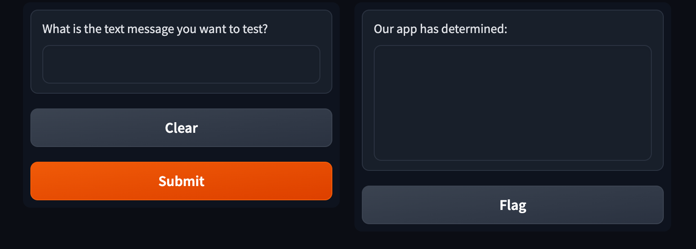
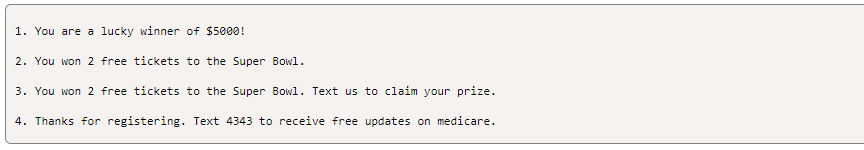

# sms_spam_detector
### Module 21 Challenge 

## Background
You'll be refactoring code from an SMS text classification solution into a function that constructs a linear Support Vector Classification (SVC) model. Once the model is created and trained, you will create a Gradio app to host the application, enabling users to test text messages. The application will provide feedback to users, indicating whether the text is classified as spam or not, based on the model's performance.

## Files

## Before You Begin
Before starting the assignment, be sure to complete the following steps:
   - [x] Create a new repository for this project called `sms_spam_detector`. **Do not add this homework assignment to an existing repository.**
   - [x] Clone the new repository to your computer.
   - [x] Inside your local Git repository, add the starter files from your file downloads.
   - [x] Push these changes to GitHub.
 
## Instructions

The starter files consist of the following files: `gradio_sms_text_classification.ipynb`, `sms_text_classification_solution.ipynb`, and `SMSSpamCollection.csv`.

## Create the SMS Classification Function

1. Using the code in the `sms_text_classification_solution.ipynb` file, create the `sms_classification` function in the `gradio_sms_text_classification.ipynb` by doing the following:

    - Set the features variable to the text message column of the DataFrame.

    - Set the target variable to the "label" column of the DataFrame.

    - Split data into training and testing and set the test_size to 33%.

    - Build a pipeline to transform the test set to compare to the training set.

    - Fit the model to the transformed training data and return model.

2. Load the `SMSSpamCollection.csv` into a DataFrame and call the `sms_classification` function with the DataFrame, and set the result to the "text_clf" variable.

## Create the SMS Prediction Function

Use the `sms_prediction` function to predict the classification of a new text by doing the following:

- Create a variable that will hold the prediction of a new text.

- Use a conditional statement that determines if the text message is "ham" or “spam”.

    - If the message is “ham”, the function should return the following message: `f'The text message: "{text}", is not spam.`

    - If the message is spam, the function should return the following message: `f'The text message: "{text}", is spam.`

## Create the Gradio Interface Application

1. Create a Gradio Interface application that takes a textbox for the inputs and has a textbox for the output. The textboxes should have labels that describe what each textbox contains.

2. Launch the application and provide the URL to share the application. Your application should look like the following:

    

3. Use the following text messages to test your application.

  

## Badges

## Visuals

## Installation

## Usage

## Support
Some of the code on this assigment was done with the help of a bootcamp tutor.

## Roadmap

## Contributing

## Authors and acknowledgment
1. Reference material - [PEP 8 – Style Guide for Python Code](https://peps.python.org/pep-0008/)
2. Python HOWTOs - [https://docs.python.org/3/howto](https://docs.python.org/3/howto/index.html)
3. Gradio Documentation -[https://www.gradio.app/docs]
4. This site was built using [GitHub Pages](https://pages.github.com/)

## License

## Project status
- Submitted for 08.13.2024

## Footnotes